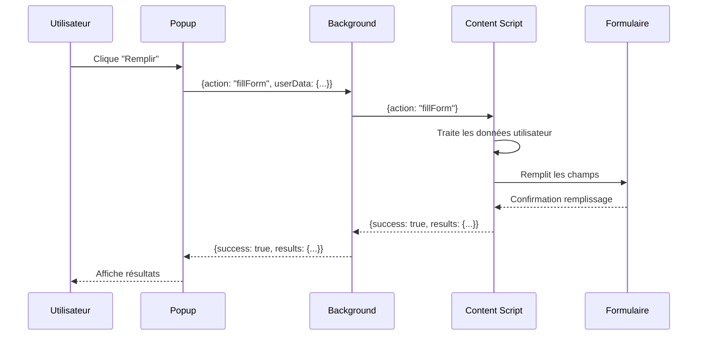
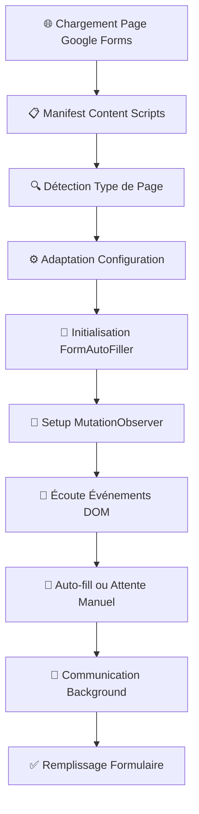
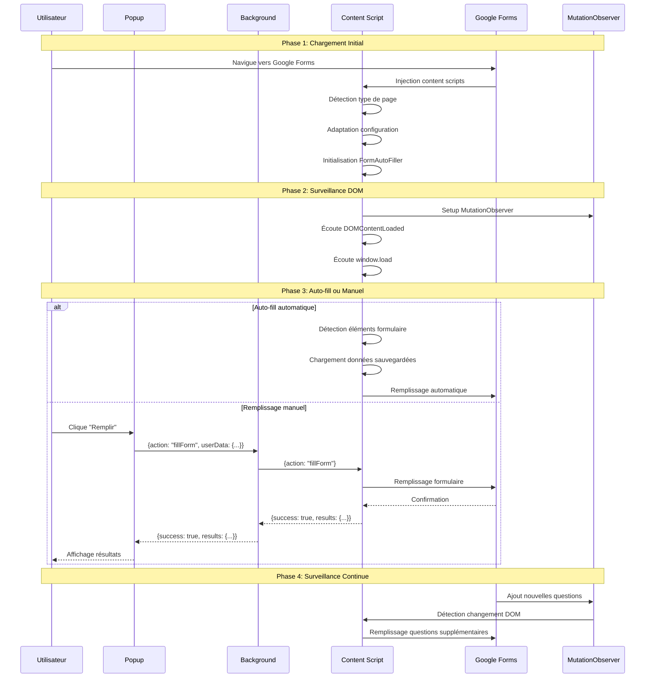

# 📋 Documentation du Background Script - FillEngine

## 🎯 Vue d'ensemble

Le **Background Script** (`background.js`) est le cœur de l'extension FillEngine. Il agit comme un **Service Worker** qui gère le cycle de vie de l'extension et facilite la communication entre les différents composants (popup, content script, et pages web).

## 🏗️ Architecture et Rôle

### Rôle Principal
Le background script sert de **pont de communication** et de **gestionnaire d'événements** pour l'extension Chrome. Il :

- 🔄 **Relaye les messages** entre le popup et le content script
- 📦 **Gère le cycle de vie** de l'extension (installation, mise à jour)
- 🔍 **Surveille les changements d'onglets** pour détecter les formulaires Google
- 💾 **Gère le stockage local** pour les métadonnées de l'extension

### Architecture du Système
```
┌─────────────┐    Message     ┌──────────────┐    Message     ┌─────────────┐
│   Popup     │ ──────────────► │  Background  │ ──────────────► │ Content     │
│ (popup.js)  │                │ (background.js)│               │ Script      │
└─────────────┘                └──────────────┘                └─────────────┘
                                        │
                                        ▼
                               ┌──────────────┐
                               │ Chrome APIs   │
                               │ - storage     │
                               │ - tabs        │
                               │ - runtime     │
                               └──────────────┘
```

## 🔧 Fonctionnalités Détaillées

### 1. Gestion du Cycle de Vie (`chrome.runtime.onInstalled`)

```javascript
chrome.runtime.onInstalled.addListener((details) => {
  console.log("Auto-Fill Google Forms extension installed", details);
  
  if (details.reason === 'install') {
    console.log("🆕 Extension installed - profiles will refresh on first popup open");
  } else if (details.reason === 'update') {
    console.log("🔄 Extension updated - profiles will auto-refresh on next popup open");
    chrome.storage.local.set({
      extensionUpdated: true,
      updateTimestamp: Date.now()
    });
  }
});
```

**Fonctionnalités :**
- ✅ **Installation** : Log l'installation initiale
- 🔄 **Mise à jour** : Marque qu'une mise à jour a eu lieu
- 💾 **Stockage** : Sauvegarde les métadonnées de mise à jour dans `chrome.storage.local`

**Détails techniques :**
- `details.reason` peut être `'install'`, `'update'`, ou `'chrome_update'`
- Les métadonnées sont stockées pour informer le popup lors de sa prochaine ouverture

### 2. Système de Messagerie (`chrome.runtime.onMessage`)

```javascript
chrome.runtime.onMessage.addListener((message, sender, sendResponse) => {
  console.log("Background received message:", message);

  if (message.action === "fillForm") {
    chrome.tabs.query({ active: true, currentWindow: true }, (tabs) => {
      if (tabs[0]) {
        chrome.tabs.sendMessage(tabs[0].id, { action: "fillForm" }, (response) => {
          sendResponse(response);
        });
      }
    });
    return true; // Keep the message channel open for async response
  }
});
```

**Fonctionnalités :**
- 📨 **Réception** : Écoute les messages du popup ou content script
- 🔄 **Relais** : Transmet les messages `fillForm` au content script de l'onglet actif
- ⚡ **Asynchrone** : Retourne `true` pour maintenir le canal ouvert pour les réponses asynchrones

**Flux de communication :**
1. **Popup** → envoie `{action: "fillForm", userData: ...}`
2. **Background** → reçoit et transmet au content script
3. **Content Script** → traite et retourne les résultats
4. **Background** → transmet la réponse au popup

### 3. Surveillance des Onglets (`chrome.tabs.onUpdated`)

```javascript
chrome.tabs.onUpdated.addListener((tabId, changeInfo, tab) => {
  if (changeInfo.status === "complete" && tab.url && tab.url.includes("docs.google.com/forms/")) {
    console.log("Google Forms page loaded:", tab.url);
  }
});
```

**Fonctionnalités :**
- 👀 **Surveillance** : Détecte quand une page Google Forms est chargée
- 🔍 **Filtrage** : Vérifie que l'URL contient `docs.google.com/forms/`
- 📝 **Logging** : Enregistre l'URL pour le débogage

## 🔄 Flux de Communication Complet

### Scénario : Remplissage de Formulaire



### Détail des Messages

#### Message Popup → Background
```javascript
{
  action: "fillForm",
  userData: {
    personal: { nom: "...", prenom: "..." },
    contact: { email: "...", telephone: "..." },
    // ... autres données CSV
  }
}
```

#### Message Background → Content Script
```javascript
{
  action: "fillForm"
  // Note: userData est transmis directement par le popup
}
```

#### Réponse Content Script → Background → Popup
```javascript
{
  success: true,
  results: {
    fieldsFilled: 15,
    detectionResults: [...],
    // ... statistiques détaillées
  }
}
```

## 🛠️ APIs Chrome Utilisées

### 1. `chrome.runtime`
- **`onInstalled`** : Gestion du cycle de vie
- **`onMessage`** : Système de messagerie

### 2. `chrome.tabs`
- **`query()`** : Récupération de l'onglet actif
- **`sendMessage()`** : Envoi de messages au content script
- **`onUpdated`** : Surveillance des changements d'onglets

### 3. `chrome.storage`
- **`local.set()`** : Stockage des métadonnées de mise à jour

## 🔒 Permissions Requises

D'après le `manifest.json` :

```json
{
  "permissions": ["activeTab", "tabs", "storage", "scripting"],
  "host_permissions": ["https://docs.google.com/forms/*", "https://storage.googleapis.com/*"]
}
```

**Explication des permissions :**
- **`activeTab`** : Accès à l'onglet actuellement actif
- **`tabs`** : Accès aux informations des onglets et capacité d'envoi de messages
- **`storage`** : Stockage local pour les métadonnées
- **`scripting`** : Injection de scripts (non utilisée dans ce cas)
- **`host_permissions`** : Accès aux domaines Google Forms et Google Cloud Storage

## 🐛 Gestion d'Erreurs et Débogage

### Logs de Débogage
Le background script inclut des logs détaillés :

```javascript
console.log("Background received message:", message);
console.log("🆕 Extension installed - profiles will refresh on first popup open");
console.log("🔄 Extension updated - profiles will auto-refresh on next popup open");
console.log("Google Forms page loaded:", tab.url);
```

### Points de Contrôle
1. **Réception de message** : Vérification de la structure du message
2. **Onglet actif** : Vérification de l'existence d'un onglet actif
3. **Envoi de message** : Gestion des erreurs de communication

## ⚡ Optimisations et Bonnes Pratiques

### 1. Canal Asynchrone
```javascript
return true; // Keep the message channel open for async response
```
- Maintient le canal ouvert pour les opérations asynchrones
- Permet au content script de répondre après traitement

### 2. Vérification d'Onglet Actif
```javascript
chrome.tabs.query({ active: true, currentWindow: true }, (tabs) => {
  if (tabs[0]) {
    // Traitement sécurisé
  }
});
```
- Vérifie l'existence d'un onglet avant envoi de message
- Évite les erreurs si aucun onglet n'est ouvert

### 3. Stockage Optimisé
```javascript
chrome.storage.local.set({
  extensionUpdated: true,
  updateTimestamp: Date.now()
});
```
- Stockage minimal des métadonnées nécessaires
- Utilisation de `chrome.storage.local` pour la persistance

## 🌐 Architecture Complète : Du Chargement de Page au Remplissage

### Vue d'Ensemble de l'Architecture Complète



### 1. Phase de Chargement Initial

#### 1.1 Injection des Content Scripts
D'après le `manifest.json`, les scripts sont injectés avec `run_at: "document_idle"` :

```javascript
"content_scripts": [
  {
    "matches": ["<all_urls>"],
    "js": [
      "src/core/config.js",           // Configuration de base
      "src/core/pageDetector.js",     // Détection de type de page
      "src/form/generateDictionary.js", // Génération du dictionnaire
      "src/form/FormDetector.js",     // Détection des formulaires
      "src/form/FieldMatcher.js",     // Correspondance des champs
      "src/form/FieldFiller.js",      // Remplissage des champs
      "src/form/FormAutoFiller.js",   // Orchestrateur principal
      "src/init/content-init.js"      // Initialisation finale
    ],
    "run_at": "document_idle",
    "all_frames": true
  }
]
```

**Ordre d'exécution critique :**
1. **Configuration** → Définit les sélecteurs par défaut
2. **Détection** → Identifie le type de page (Google Forms, test, générique)
3. **Adaptation** → Modifie la configuration selon le type détecté
4. **Classes** → Initialise les classes de traitement
5. **Initialisation** → Lance l'orchestrateur principal

#### 1.2 Détection et Adaptation Dynamique

```javascript
// src/core/pageDetector.js
function detectPageTypeAndAdaptConfig() {
  const url = window.location.href;
  const hostname = window.location.hostname;

  if (hostname.includes("docs.google.com") && url.includes("/forms/")) {
    // Configuration spécifique Google Forms
    CONFIG.containerSelectors = [
      '[role="listitem"]',
      '[data-params*="question"]',
      ".m2",
      ".freebirdFormviewerViewItemsItemItem",
      ".Xb9hP",
      ".geS5n",
      ".AgroKb",
    ];
    return "google-forms";
  }
  // ... autres types de pages
}
```

**Types de pages supportées :**
- ✅ **Google Forms** : Sélecteurs optimisés pour l'interface Google
- 🧪 **Pages de test** : Sélecteurs génériques pour développement local
- 🌐 **Pages génériques** : Sélecteurs universels pour autres formulaires

### 2. Phase d'Initialisation Avancée

#### 2.1 Gestion des Événements DOM

```javascript
function initializeWithNativeEvents() {
  // Écoute des événements critiques
  if (document.readyState === 'loading') {
    document.addEventListener('DOMContentLoaded', handleDOMReady);
  } else {
    handleDOMReady(); // DOM déjà prêt
  }
  
  if (document.readyState === 'complete') {
    handleWindowLoad();
  } else {
    window.addEventListener('load', handleWindowLoad);
  }
}
```

**Événements surveillés :**
- **`DOMContentLoaded`** : DOM prêt, initialisation précoce
- **`window.load`** : Page complètement chargée, auto-fill possible
- **`popstate`** : Navigation SPA, réinitialisation nécessaire
- **`unload`** : Nettoyage des ressources

#### 2.2 MutationObserver pour Contenu Dynamique

```javascript
function setupGoogleFormsObserver() {
  googleFormsObserver = new MutationObserver((mutations) => {
    mutations.forEach((mutation) => {
      if (mutation.type === "childList" && mutation.addedNodes.length > 0) {
        for (const node of mutation.addedNodes) {
          // Détection spécifique Google Forms
          const isGoogleFormsQuestion = 
            node.matches && (
              node.matches('[role="listitem"]') ||
              node.matches('.freebirdFormviewerViewItemsItemItem') ||
              // ... autres sélecteurs Google Forms
            );
          
          if (isGoogleFormsQuestion) {
            // Déclenchement immédiat de l'auto-fill
            triggerDelayedAutoFill(500);
          }
        }
      }
    });
  });

  // Observer avec options optimisées
  googleFormsObserver.observe(document.body, {
    childList: true,
    subtree: true,
    attributes: true,
    attributeFilter: ['role', 'class', 'data-params']
  });
}
```

**Fonctionnalités du MutationObserver :**
- 🔍 **Détection en temps réel** des nouvelles questions Google Forms
- ⚡ **Déclenchement immédiat** de l'auto-fill (500ms de délai)
- 🎯 **Sélecteurs spécifiques** pour les éléments Google Forms
- 🔄 **Surveillance continue** des changements DOM

### 3. Phase de Remplissage Automatique

#### 3.1 Logique de Déclenchement Intelligent

```javascript
async function performAutoFill() {
  // Vérifications préliminaires
  if (hasTriggeredAutoFill) return; // Éviter les doublons
  if (pageType !== 'google-forms') return; // Google Forms uniquement
  
  // Chargement des données sauvegardées
  const savedUserData = await loadSavedUserData();
  if (!savedUserData) return;
  
  // Vérification de la présence d'éléments de formulaire
  const containers = FormDetector.findQuestionContainers();
  if (containers.length === 0) return;
  
  // Marquage pour éviter les déclenchements multiples
  hasTriggeredAutoFill = true;
  
  // Mise à jour du profil utilisateur
  autoFiller.updateUserProfile(savedUserData);
  
  // Exécution du remplissage
  const result = await autoFiller.fillForm();
}
```

**Conditions de déclenchement :**
- ✅ Page Google Forms détectée
- ✅ Données utilisateur disponibles
- ✅ Éléments de formulaire présents
- ✅ Pas de remplissage déjà effectué

#### 3.2 Stratégies de Timing

```javascript
function handleWindowLoad() {
  if (pageType === 'google-forms' && !hasTriggeredAutoFill) {
    const containers = FormDetector.findQuestionContainers();
    
    if (containers.length > 0) {
      // Vérification des éléments interactifs
      const hasInteractiveElements = containers.some(container => {
        return container.querySelector('[role="radio"], [role="checkbox"]') ||
               container.querySelector('input[type="radio"], input[type="checkbox"]');
      });
      
      if (hasInteractiveElements) {
        // Délai étendu pour les éléments interactifs
        triggerDelayedAutoFill(1500);
      } else {
        // Remplissage immédiat pour les champs simples
        performAutoFill();
      }
    } else {
      // Attente du contenu dynamique
      triggerDelayedAutoFill(2000);
    }
  }
}
```

**Stratégies de timing :**
- ⚡ **Immédiat** : Champs texte simples détectés
- ⏱️ **1500ms** : Éléments interactifs (radio, checkbox)
- ⏳ **2000ms** : Contenu dynamique non encore chargé
- 🔄 **500ms** : Nouvelles questions détectées par MutationObserver

### 4. Flux de Communication Complet

#### 4.1 Séquence Complète : Chargement → Remplissage



#### 4.2 Gestion des Cas Particuliers

**Navigation SPA (Single Page Application) :**
```javascript
window.addEventListener('popstate', () => {
  Logger.info('🔄 Navigation detected, resetting auto-fill state');
  hasTriggeredAutoFill = false;
  const newPageType = detectPageTypeAndAdaptConfig();
  
  if (newPageType !== pageType) {
    pageType = newPageType;
    if (pageType === 'google-forms') {
      setupGoogleFormsObserver();
    } else {
      cleanup();
    }
  }
});
```

**Nettoyage des ressources :**
```javascript
function cleanup() {
  if (googleFormsObserver) {
    googleFormsObserver.disconnect();
    googleFormsObserver = null;
  }
  if (autoFillTimeout) {
    clearTimeout(autoFillTimeout);
    autoFillTimeout = null;
  }
  hasTriggeredAutoFill = false;
  isPageReady = false;
}
```

### 5. Optimisations et Performance

#### 5.1 Débouncing et Anti-Doublons

```javascript
function triggerDelayedAutoFill(delay = 1000) {
  // Annulation du timer précédent
  if (autoFillTimeout) {
    clearTimeout(autoFillTimeout);
  }
  
  autoFillTimeout = setTimeout(() => {
    performAutoFill();
  }, delay);
}
```

#### 5.2 Détection Précoce et Optimisée

```javascript
function handleDOMReady() {
  // Initialisation précoce de l'observer
  if (pageType === 'google-forms') {
    setupGoogleFormsObserver();
  }
  
  // Détection précoce des éléments
  const containers = FormDetector.findQuestionContainers();
  if (containers.length > 0) {
    isPageReady = true; // Marquer comme prêt
  }
}
```

## 🔮 Extensions Possibles

### Fonctionnalités Futures
1. **Cache intelligent** : Mise en cache des données utilisateur
2. **Synchronisation** : Synchronisation entre onglets
3. **Analytics** : Collecte de métriques d'utilisation
4. **Notifications** : Notifications de statut de remplissage

### Améliorations Techniques
1. **Retry logic** : Retry automatique en cas d'échec
2. **Batch processing** : Traitement par lots pour plusieurs formulaires
3. **Error reporting** : Rapport d'erreurs automatique

## 📚 Ressources et Références

### Documentation Chrome Extensions
- [Chrome Extensions API](https://developer.chrome.com/docs/extensions/reference/)
- [Service Workers](https://developer.chrome.com/docs/extensions/mv3/service_workers/)
- [Message Passing](https://developer.chrome.com/docs/extensions/mv3/messaging/)

### Fichiers Associés
- `manifest.json` : Configuration de l'extension
- `popup.js` : Interface utilisateur
- `src/init/content-init.js` : Script de contenu principal

---

*Cette documentation est générée automatiquement pour l'extension FillEngine v1.1.1*
